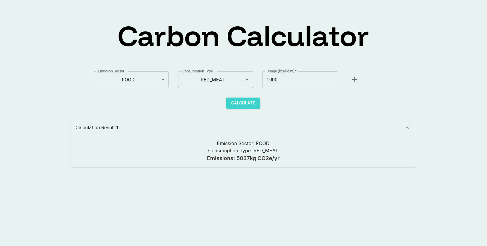

# 🌍 Carbon Calculator

Carbon Calculator is a lightweight web application that helps users estimate their **carbon footprint** by entering data about energy consumption, transportation, and more.

The tool dynamically calculates emissions using official emission factors and provides clear feedback to help individuals and businesses take action for a greener planet.

---

## 🚀 Features

- ♻️ Dynamic, multi-row form for entering different types of consumption
- ⚡ Real-time carbon footprint calculations via GraphQL
- 📊 Emission sectors and consumption types fetched from a remote API
- 🌐 Built with React + Apollo Client
- 💅 Styled with MUI and TailwindCSS
- 🧪 Fully tested with Jest + React Testing Library

---

## 📸 Preview



---

## 📦 Tech Stack

| Tech               | Purpose                         |
|--------------------|----------------------------------|
| React              | Frontend framework              |
| TypeScript         | Type-safe development           |
| Apollo Client      | GraphQL client                  |
| GraphQL            | API interaction + query language|
| MUI (Material UI)  | Components + styling            |
| Tailwind CSS       | Utility-first styling           |
| Jest & RTL         | Testing                         |

---

## 🔧 Getting Started

### 1. Clone the repository

```bash
git clone https://github.com/your-username/co2track.git
cd co2track
```

### 2. Install dependencies

```bash
npm install
```

### 3. Run the app

```bash
npm run dev
```

The app will be available at: [http://localhost:5173](http://localhost:5173)

> This project uses **Vite** as the bundler.

---

## 🧪 Running Tests

Tests are written using **Jest** and **React Testing Library**.

To run tests:

```bash
npm test
```

Make sure the following config files are present:

- `jest.config.ts`
- `setupTests.ts`

> Tailwind CSS and other static files are mocked for test environment.

---

## 🛠 Project Structure

```
.
├── public/               # Static assets
├── src/
│   │── api/              # Related files with API integrations
│   │   │── graphql/      # GraphQL API integration files
│   ├── interfaces/       # Folder containing project interfaces
│   ├── App.tsx           # Main component
│   ├── App.spec.tsx      # Unit tests
│   ├── styles.css        # Tailwind styles
├── jest.config.ts        # Jest config
├── setupTests.ts         # RTL setup
├── tsconfig.json
└── vite.config.ts
```

---

## 📤 Deployment

You can deploy this app to any static hosting service like:

- **Vercel**
- **Netlify**
- **GitHub Pages**
- **Firebase Hosting**

To build for production:

```bash
npm run build
```

Then follow your platform’s instructions for deploying the `dist/` folder.

Made with 💻 by Douglas Brandão
